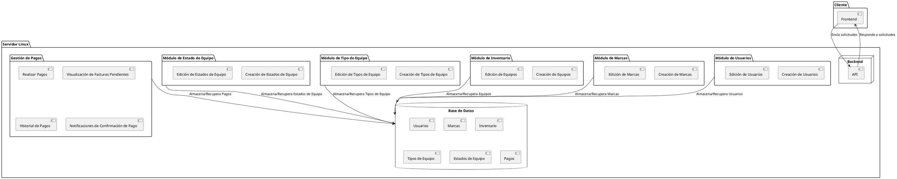
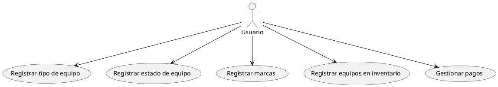
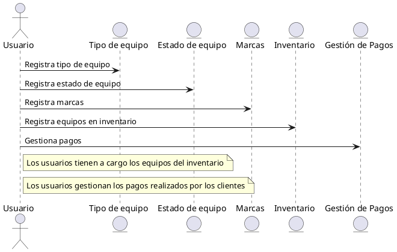
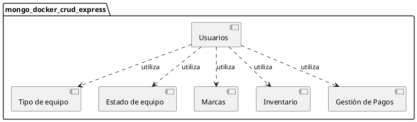
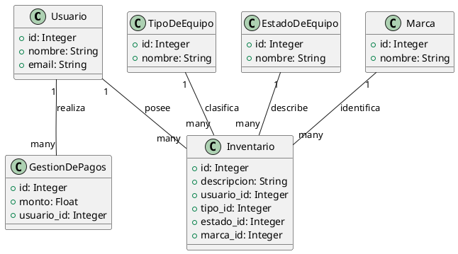

<!--todo lo refrente a creación de diagramas, modelado, arquitectura será diseñado en plamuml  -->

# **mongo_docker_crud_express**

Este repositorio contiene un proyecto de ejemplo que utiliza MongoDB, Docker y Express.js para crear una aplicación CRUD (Crear, Leer, Actualizar, Eliminar) básica.

## **Requisitos previos**

Antes de comenzar, asegúrate de cumplir con los siguientes requisitos:

- Docker instalado en tu sistema. Si no tienes Docker instalado, puedes seguir las instrucciones de instalación en [este enlace](https://docs.docker.com/get-docker/).

## **Configuración**

Sigue estos pasos para configurar el proyecto en tu entorno de desarrollo:

1. Clona este repositorio en tu máquina local:
2. Navega hasta la carpeta del proyecto:
3. Configura las variables de entorno necesarias. Puedes editar el archivo `.env` y modificar los valores según sea necesario.

## **Instalación**

Sigue estos pasos para construir y ejecutar el contenedor de Docker:

1. Ejecuta el siguiente comando para iniciar el contenedor:

Esto construirá y ejecutará el contenedor de Docker con la aplicación.

## **Uso**

Una vez que el contenedor de Docker esté en ejecución, puedes utilizar la aplicación. A continuación, se muestran algunos ejemplos de las rutas y métodos HTTP disponibles:

- `GET /api/users`: Obtiene todos los usuarios.
- `GET /api/users/:id`: Obtiene un usuario específico por su ID.
- `POST /api/users`: Crea un nuevo usuario.
- `PUT /api/users/:id`: Actualiza un usuario existente por su ID.
- `DELETE /api/users/:id`: Elimina un usuario por su ID.

Puedes utilizar herramientas como Postman o cURL para realizar las solicitudes HTTP correspondientes a estas rutas.

## **Contribución**

¡Las contribuciones son bienvenidas! Si deseas contribuir al proyecto, sigue estos pasos:

1. Haz un fork de este repositorio.
2. Crea una rama para tu contribución: `git checkout -b nombre-de-la-rama`.
3. Realiza los cambios y realiza commits descriptivos.
4. Envía una solicitud pull con tus cambios.


## **Descripción**

La universidad Digital de Antioquia necesita llevar el control de los equipos de cómputo 
(computadores (escritorio y portátiles), mouse, teclado, monitores, etc.), móviles (celulares, 
tabletas, parlantes, etc.), etc. Para ello requiere contar con una aplicación web en donde se registren 
los datos de los distintos equipos que tienen actualmente en su inventario para tener un mejor 
control de dichos equipos. El sistema deberá contar con los siguientes 4 módulos:


## **Módulos**
El sistema se compone de varios módulos, cada uno con su propia funcionalidad:

1. **Tipo de Equipo**: Este módulo permite al usuario gestionar diferentes tipos de equipos. Los usuarios pueden agregar, editar, eliminar y visualizar los tipos de equipos disponibles.

2. **Estado de Equipo**: Este módulo permite al usuario gestionar los diferentes estados en los que puede encontrarse un equipo. Los usuarios pueden agregar, editar, eliminar y visualizar los estados de los equipos.

3. **Marca**: Este módulo permite al usuario gestionar las diferentes marcas de los equipos. Los usuarios pueden agregar, editar, eliminar y visualizar las marcas de los equipos.

4. **Equipo**: Este módulo permite al usuario gestionar los equipos en inventario. Los usuarios pueden agregar, editar, eliminar y visualizar los equipos disponibles en el inventario.

```plantuml
mongo_docker_crud_express
│
├── Tipo de Equipo
│   ├── id: Identificador único del tipo de equipo.
│   ├── nombre: Nombre del tipo de equipo.
│
├── Estado de Equipo
│   ├── id: Identificador único del estado del equipo.
│   ├── nombre: Nombre del estado del equipo.
│
├── Marca
│   ├── id: Identificador único de la marca.
│   ├── nombre: Nombre de la marca.
│
├── Equipo
│   ├── id: Identificador único del equipo.
│   ├── descripcion: Descripción detallada del equipo.
│   ├── usuario_id: Identificador del usuario que tiene asignado el equipo.
│   ├── tipo_id: Identificador del tipo de equipo.
│   ├── estado_id: Identificador del estado del equipo.
│   ├── marca_id: Identificador de la marca del equipo.
│
└── Pago
    ├── id: Identificador único del pago.
    ├── monto: Monto del pago.
    └── usuario_id: Identificador del usuario que realizó el pago.
```


## **Arquítectura**
Este diagrama muestra la estructura general del sistema y cómo se comunican sus componentes. En este caso, se muestra cómo el frontend se comunica con el backend a través de una API, y cómo el backend interactúa con la base de datos y los diferentes módulos del sistema.




## **Diagrama de casos de uso**
Este diagrama muestra las diferentes acciones que un usuario puede realizar en el sistema. En este caso, las acciones incluyen registrar tipos de equipos, estados de equipos, marcas, equipos en inventario y gestionar pagos.

Diagrama de Secuencia: Este diagrama muestra cómo se realizan las interacciones entre los usuarios y los diferentes componentes del sistema en un orden secuencial. En este caso, muestra cómo un usuario registra tipos de equipos, estados de equipos, marcas, equipos en inventario y gestiona pagos.


    
    

### **Diagrama de secuencia**
Este diagrama muestra cómo se realizan las interacciones entre los usuarios y los diferentes componentes del sistema en un orden secuencial. En este caso, muestra cómo un usuario registra tipos de equipos, estados de equipos, marcas, equipos en inventario y gestiona pagos.


  


### **Diagrama de componentes**
Este diagrama muestra los diferentes componentes del sistema y cómo interactúan entre sí. En este caso, muestra cómo los usuarios utilizan los diferentes módulos del sistema.



### **Modelado MER y MR**
MER (Modelo Entidad-Relación) y MR (Modelo Relacional) son técnicas de modelado de datos que describen cómo los datos están organizados y cómo se relacionan entre sí.


### **Diagrama de clases**
Este es un Diagrama de Clases que representa la estructura del sistema en términos de sus clases, sus propiedades y las relaciones entre ellas. Aquí están las definiciones de las clases y sus relaciones:

1. **Usuario**: Esta clase representa a los usuarios del sistema. Cada usuario tiene un identificador único (`id`), un nombre (`nombre`) y un correo electrónico (`email`).

2. **TipoDeEquipo**: Esta clase representa los diferentes tipos de equipos que pueden existir en el sistema. Cada tipo de equipo tiene un identificador único (`id`) y un nombre (`nombre`).

3. **EstadoDeEquipo**: Esta clase representa los diferentes estados en los que puede encontrarse un equipo. Cada estado de equipo tiene un identificador único (`id`) y un nombre (`nombre`).

4. **Marca**: Esta clase representa las diferentes marcas de los equipos. Cada marca tiene un identificador único (`id`) y un nombre (`nombre`).

5. **Inventario**: Esta clase representa los equipos en el inventario del sistema. Cada equipo en el inventario tiene un identificador único (`id`), una descripción (`descripcion`), y los identificadores del usuario que lo posee (`usuario_id`), su tipo (`tipo_id`), su estado (`estado_id`) y su marca (`marca_id`).

6. **GestionDePagos**: Esta clase representa los pagos realizados por los usuarios. Cada pago tiene un identificador único (`id`), un monto (`monto`) y el identificador del usuario que realizó el pago (`usuario_id`).

Las relaciones entre las clases se representan con líneas que conectan las clases. Por ejemplo, la línea entre `Usuario` e `Inventario` indica que un `Usuario` puede poseer muchos equipos en el `Inventario`. De manera similar, un `Usuario` puede realizar muchos `GestionDePagos`, un `TipoDeEquipo` puede clasificar muchos equipos en el `Inventario`, un `EstadoDeEquipo` puede describir muchos equipos en el `Inventario`, y una `Marca` puede identificar muchos equipos en el `Inventario`.




### **Mockups**
Un mockup es una representación visual a escala completa de un diseño o interfaz, utilizado para demostrar la funcionalidad y apariencia de un producto antes de su fabricación o implementación. Los mockups son comúnmente utilizados en el diseño de productos y en el desarrollo de software para presentar propuestas de diseño, realizar pruebas de usuario y obtener retroalimentación.

En el contexto del desarrollo de software, un mockup puede es una representación estática de una página web o aplicación que muestra la disposición de los elementos de la interfaz de usuario, como botones, menús, barras de navegación, formularios, etc. Los mockups pueden ser de baja fidelidad (bocetos a mano o diagramas simples) o de alta fidelidad (representaciones detalladas que se asemejan al producto final).

Los mockups son una herramienta valiosa para los diseñadores y desarrolladores, ya que permiten visualizar cómo se verá y funcionará el producto final, facilitando la detección de problemas y la realización de cambios antes de que el desarrollo esté muy avanzado.


## **Licencia**

Este proyecto está bajo la [licencia MIT](LICENSE).