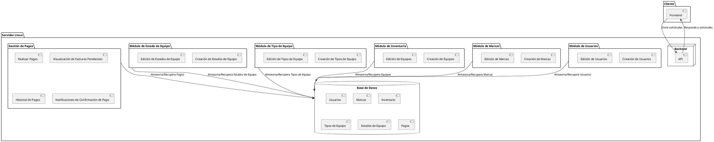

<!--todo lo refrente a creación de diagramas, modelado, arquitectura será diseñado en plamuml  -->

# **mongo_docker_crud_express**

Este repositorio contiene un proyecto de ejemplo que utiliza MongoDB, Docker y Express.js para crear una aplicación CRUD (Crear, Leer, Actualizar, Eliminar) básica.

## **Requisitos previos**

Antes de comenzar, asegúrate de cumplir con los siguientes requisitos:

- Docker instalado en tu sistema. Si no tienes Docker instalado, puedes seguir las instrucciones de instalación en [este enlace](https://docs.docker.com/get-docker/).

## **Configuración**

Sigue estos pasos para configurar el proyecto en tu entorno de desarrollo:

1. Clona este repositorio en tu máquina local:
2. Navega hasta la carpeta del proyecto:
3. Configura las variables de entorno necesarias. Puedes editar el archivo `.env` y modificar los valores según sea necesario.

## **Instalación**

Sigue estos pasos para construir y ejecutar el contenedor de Docker:

1. Ejecuta el siguiente comando para iniciar el contenedor:

Esto construirá y ejecutará el contenedor de Docker con la aplicación.

## **Uso**

Una vez que el contenedor de Docker esté en ejecución, puedes utilizar la aplicación. A continuación, se muestran algunos ejemplos de las rutas y métodos HTTP disponibles:

- `GET /api/users`: Obtiene todos los usuarios.
- `GET /api/users/:id`: Obtiene un usuario específico por su ID.
- `POST /api/users`: Crea un nuevo usuario.
- `PUT /api/users/:id`: Actualiza un usuario existente por su ID.
- `DELETE /api/users/:id`: Elimina un usuario por su ID.

Puedes utilizar herramientas como Postman o cURL para realizar las solicitudes HTTP correspondientes a estas rutas.

## **Contribución**

¡Las contribuciones son bienvenidas! Si deseas contribuir al proyecto, sigue estos pasos:

1. Haz un fork de este repositorio.
2. Crea una rama para tu contribución: `git checkout -b nombre-de-la-rama`.
3. Realiza los cambios y realiza commits descriptivos.
4. Envía una solicitud pull con tus cambios.

## **Licencia**

Este proyecto está bajo la [licencia MIT](LICENSE).

## **Descripción**

La universidad Digital de Antioquia necesita llevar el control de los equipos de cómputo 
(computadores (escritorio y portátiles), mouse, teclado, monitores, etc.), móviles (celulares, 
tabletas, parlantes, etc.), etc. Para ello requiere contar con una aplicación web en donde se registren 
los datos de los distintos equipos que tienen actualmente en su inventario para tener un mejor 
control de dichos equipos. El sistema deberá contar con los siguientes 4 módulos:

## **Módulo de tipo de equipo**
Este módulo permitirá registrar los tipos de equipos que tendrá el sistema. En el requerimiento se 
definen dos (2) (computo, móviles), pero podrán existir más en la medida que el sistema se coloque 
en marcha. Para este módulo se necesitará guardar la siguiente información por cada tipo de 
computo: 
I. Nombre. 
II. Estado (Activo o inactivo). 
III. Fecha creación. 
IV. Fecha de actualización. 
El sistema permitirá la creación y edición de los tipos de equipo. 

## **Módulo de estado de equipo**
Este módulo permitirá registrar los estados en los cuales se podrá encontrar un equipo en un 
determinado momento (en uso, en bodega, depreciado, etc.). Para este módulo se necesitará 
guardar la siguiente información por cada tipo de computo:

V. Nombre. 

VI. Estado (Activo o inactivo). 

VII. Fecha creación. 

VIII. Fecha de actualización. 

El sistema permitirá la creación y edición de los tipos de equipo. 

## **Módulo de usuarios**
Este módulo permitirá registrar los distintos usuarios que tendrán a cargo los equipos del inventario. 
Para este módulo se necesitará guardar la siguiente información por cada usuario: 

I. Nombre. 

II. Email. 

III. Estado (Activo o inactivo). 

IV. Fecha creación. 

V. Fecha de actualización. 

El sistema permitirá la creación y edición de usuarios.

## **Módulo de marcas**
Este módulo permitirá registrar las distintas marcas de los equipos. Para este módulo se necesitará 
guardar la siguiente información para cada marca: 

I. Nombre. 

II. Estado (Activo o inactivo). 

III. Fecha creación. 

IV. Fecha de actualización. 

El sistema permitirá la creación y edición de las marcas. 

## **Módulo de inventario**
Este módulo se encargará de registrar los distintos equipos del inventario. Para este módulo se 
necesitará guardar la siguiente información: 

I. Serial: campo único. 

II. Modelo: campo único. 

III. Descripción. 

IV. Foto del equipo. Se requiere guardar la URL de la imagen. 

V. Color. 

VI. Fecha de compra. 

VII. Precio. 

VIII. Usuario a cargo. El sistema deberá permitir la selección de sólo los usuarios activos definidos 
en el modelo de usuarios. 

IX. Marca. El sistema deberá permitir la selección de solo las marcas activas definidas en el 
módulo de marcas. 

X. Estado del equipo. El sistema deberá permitir la selección de solo los estados definidos en 
el módulo de estados de equipo. 

XI. Tipo de equipo. El sistema deberá permitir la selección de solo los tipos definidos en el 
módulo de tipos de equipo. 

El sistema permitirá la creación y edición de los equipos del inventario.  

## **Módulo de Gestión de Pagos**

Este módulo permitirá gestionar los pagos realizados por los clientes. Proporcionará funcionalidades para realizar pagos, visualizar facturas pendientes, ver el historial de pagos y recibir notificaciones de confirmación de pago. Para este módulo, se necesitará guardar la siguiente información:

### **Realizar Pagos**

I. Método de pago: campo de selección que permita escoger el método de pago.

II. Confirmación de pago: estado que indique si el pago se ha realizado con éxito.

### **Visualización de Facturas Pendientes**

I. Lista de facturas: muestra todas las facturas pendientes de pago.

II. Detalles de la factura: incluye el monto, la fecha de vencimiento y los servicios o productos facturados.

### **Historial de Pagos**

I. Lista de pagos: muestra todos los pagos realizados.

II. Detalles del pago: incluye la cantidad, la fecha y el método de pago.

### **Notificaciones de Confirmación de Pago**

I. Notificación: mensaje que se envía después de realizar un pago.

II. Detalles de la notificación: incluye detalles del pago, como la cantidad, la fecha y el método de pago.

El sistema permitirá la creación, visualización y edición de los pagos y las facturas.

## **Arquítectura**

    
    

